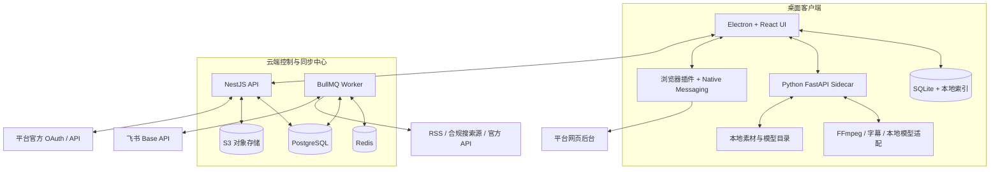

# 内容引擎技术实施方案

## Web-first 基线（2026-07-24）

已建立 `content-engine/server`：Fastify API、PostgreSQL 迁移、JWT 登录、工作空间快照迁移桥、AES-256-GCM 凭据库、RSS 刷新、Tavily 检索、公开链接剪藏、BullMQ 队列和百炼 CLI Worker。前端新增 Web 登录页和 HTTP 客户端；在浏览器会话存在时，工作空间状态改为调用 `/api/v1/workspace/state`，RSS 刷新改为调用服务端 API。

本地依赖通过 `content-engine/docker-compose.yml` 提供 PostgreSQL 16 和 Redis 7。启动顺序为 Docker Desktop、`docker compose up -d`、`npm run db:migrate`、`npm run dev`；Worker 使用 `npm run dev:worker` 单独启动。

> 状态：Draft v0.1  
> 日期：2026-07-22  
> 架构原则：桌面端承担本地生产与算力；云端承担持续在线任务、主数据和受控集成。

## 1. 技术目标

1. 支持 Windows 优先的高性能桌面内容生产体验。
2. 支持离线编辑、本地大文件和本地 GPU 任务。
3. 支持云端定时热点、飞书同步、官方 API 数据读取和跨设备元数据同步。
4. 通过适配器隔离模型、平台和信息源差异。
5. 不将平台密码、Cookie 或本地浏览器登录态上传到云端。

## 2. 总体架构



## 3. 技术栈

| 层级 | 选择 | 原因 |
| --- | --- | --- |
| 桌面壳 | Electron | Chromium、Node、媒体工具和浏览器协作生态成熟 |
| 桌面 UI | React + TypeScript + Vite | 组件化、类型安全、与插件共享类型 |
| 本地数据 | SQLite + Drizzle ORM | 离线草稿、任务缓存、素材索引；与 PostgreSQL 共享类型 |
| 本地计算 | Python 3.11 + FastAPI Sidecar + uv | 方便接 FFmpeg、AI/视频工具、GPU 库 |
| 云端 API | NestJS + TypeScript | 模块化、队列和授权结构清晰 |
| 云端主库 | PostgreSQL + Drizzle ORM | 多租户关系数据、审计、查询能力 |
| 队列 | Redis + BullMQ | 定时任务、重试、可观测任务状态 |
| 对象存储 | S3 兼容对象存储 | 缩略图、同步素材、导出包 |
| 浏览器插件 | WXT + TypeScript + Manifest V3 | 剪藏、页面检测、预填、Native Messaging |
| 视频合成 | FFmpeg；P1 引入 Remotion | 本地稳定合成，后续做模板化视频 |
| UI 图标 | Lucide | 统一、可访问、避免手绘 SVG 不一致 |

## 4. 代码仓库结构

```text
content-engine/
├─ apps/
│  ├─ desktop/                 # Electron 主进程、预加载、React 渲染进程
│  ├─ cloud-api/               # NestJS API
│  ├─ cloud-worker/            # BullMQ 任务处理器
│  ├─ extension/               # 浏览器插件
│  └─ sidecar/                 # Python FastAPI 本地服务
├─ packages/
│  ├─ domain/                  # 领域模型、状态机、共享 TypeScript 类型
│  ├─ ui/                      # 设计系统与共享组件
│  ├─ adapters/                # 模型、来源、飞书、平台连接器接口
│  ├─ content-ast/             # Canonical Content AST 与平台转换器
│  ├─ prompts/                 # 题材/平台/风格模板
│  └─ config/                  # 共享配置、lint、tsconfig
├─ infra/
│  ├─ docker/
│  ├─ migrations/
│  └─ deployment/
└─ docs/
```

使用 `pnpm workspace` 管理 Node/TypeScript 部分；Python Sidecar 独立使用 `uv` 或 Poetry 管理依赖。

## 5. 领域模型与数据表

### 5.1 云端主表

| 表 | 关键字段 |
| --- | --- |
| users | id, email, profile, status |
| workspaces | id, name, owner_id, plan, timezone |
| workspace_members | workspace_id, user_id, role（P0 仅 owner） |
| topics | id, workspace_id, name, keywords, exclusions, strategy |
| sources | id, topic_id, type, config, schedule, health |
| intelligence_items | id, workspace_id, source_id, title, url, summary, published_at, trust, heat, hash |
| topic_candidates | id, workspace_id, title, brief, status, source_links, planned_at |
| content_projects | id, workspace_id, topic_candidate_id, title, status, brief, style_profile_id |
| content_versions | id, project_id, platform, status, content_ast, rendered_content, version_no |
| assets | id, workspace_id, storage_scope, type, uri, checksum, rights, metadata |
| project_assets | project_id, asset_id, role, scene_id |
| video_projects | id, project_id, status, duration, aspect_ratio, timeline_json |
| render_jobs | id, video_project_id, executor, status, payload, result, error |
| channel_accounts | id, workspace_id, platform, auth_mode, status, metadata |
| publication_tasks | id, content_version_id, account_id, status, scheduled_at, platform_content_id, result |
| metrics_snapshots | id, publication_task_id, source, collected_at, metrics_json |
| insights | id, workspace_id, scope, conclusion, evidence, status |
| integrations | id, workspace_id, provider, config_encrypted, status |
| sync_mappings | id, workspace_id, provider, remote_id, local_type, local_id, mapping_json |
| audit_logs | id, workspace_id, actor, action, entity_type, entity_id, payload |

### 5.2 本地 SQLite 表

- `local_drafts`：尚未同步或离线编辑中的内容版本。
- `asset_index`：本地路径、缩略图、哈希、时长、尺寸、同步状态。
- `local_jobs`：本机渲染/导出任务与状态。
- `model_registry`：已安装模型、版本、路径、显存需求、许可信息。
- `browser_profiles`：仅保存本机配置引用，**不保存或上传 Cookie 原文**。
- `sync_outbox`：待推送云端的变更事件。

## 6. Canonical Content AST

平台版本不能只存纯文本。定义与平台无关的内容 AST：

```ts
type ContentDocument = {
  id: string;
  title: string;
  summary?: string;
  blocks: ContentBlock[];
  citations: Citation[];
  tags: string[];
  callToAction?: string;
};

type ContentBlock =
  | { type: 'heading'; level: 1 | 2 | 3; text: string }
  | { type: 'paragraph'; text: string; marks?: Mark[] }
  | { type: 'image'; assetId: string; caption?: string; alt?: string }
  | { type: 'quote'; text: string; source?: string }
  | { type: 'list'; ordered: boolean; items: string[] }
  | { type: 'embed'; provider: string; payload: unknown }
  | { type: 'scene'; sceneId: string; script: string };
```

转换器负责：

- 公众号：AST → 兼容内联样式 HTML。
- 小红书：AST → 分页图文结构与卡片文案。
- 视频号：AST → 口播稿、字幕、场景和分镜。

## 7. 状态机实施

状态机放在 `packages/domain`，客户端和服务端共用，只能通过受控事件迁移。

```text
TopicCandidate: PENDING → ACCEPTED → PROJECT_CREATED | DISCARDED
ContentProject: BRIEF → WRITING → VISUAL → VIDEO → REVIEW → SCHEDULED → PARTIALLY_PUBLISHED → PUBLISHED → RETROSPECTIVE → ARCHIVED
ContentVersion: DRAFT → PREFLIGHT_PASSED → WAITING_CONFIRMATION | PUBLISHED | FAILED | CANCELLED
PublicationTask: SCHEDULED → PREFLIGHT_RUNNING → WAITING_CONFIRMATION → PLATFORM_OPENED → SUBMITTED → PUBLISHED_CONFIRMED | FAILED | CANCELLED
RenderJob: WAITING_LOCAL → QUEUED → RUNNING → SUCCEEDED | FAILED | RETRYING
```

每次迁移写入 `audit_logs`，并触发必要的同步/通知事件。

## 8. 本地与云端任务路由

| 任务 | 执行位置 | 路由规则 |
| --- | --- | --- |
| 热点采集、去重、摘要 | 云端 Worker | 固定定时任务，用户关机仍执行 |
| 飞书同步 | 云端 Worker | 使用集成凭据和映射记录 |
| 内容草稿编辑 | 桌面优先 | 本地立即保存，异步同步云端 |
| 生成文案/图片提示词 | 云端或桌面 | 由模型适配器和用户配置决定 |
| 大视频、字幕、FFmpeg 合成 | 本地 Sidecar | 本机可用时执行；否则等待本机或导出 |
| 账号发布辅助 | 本地插件 | 仅在用户已登录页面中运行 |
| 官方数据读取 | 云端 Worker | 仅在 OAuth/官方 API 可用时执行 |

### 8.1 同步策略

- 云端采用 `updated_at + revision`；桌面使用 Outbox 模式上报变更。
- P0 仅支持整篇内容版本冲突：保留本地和云端版本，用户选择保留其中一份；区块级合并属于 P1。
- 素材元数据和排期冲突以最后编辑时间较新者作为候选结果，但必须在同步中心提示用户确认，不做静默覆盖。
- 大文件不做自动全量双向同步；同步缩略图、元数据、导出包和用户明确上传的版本。
- 本机渲染任务只同步任务状态和结果链接，不上传模型目录。

## 9. 飞书 Base 集成

### 9.1 权限和身份

- OAuth 优先，以用户身份连接其有权访问的 Base。
- 密钥/Token 加密存储，绝不输出到日志或客户端界面。
- 产品默认使用自身数据库；飞书连接失败只影响协作同步。

### 9.2 同步对象

| 产品对象 | 飞书对象 | 同步方向 |
| --- | --- | --- |
| 热点资讯 | 资讯库记录 | P0 产品 → 飞书 |
| 选题 | 选题池记录 | P0 产品 → 飞书；P1 备注/标签回写 |
| 内容项目摘要 | 内容库记录 | P1 产品 → 飞书 |
| 审核意见 | 审核字段/评论 | P1 飞书 → 产品 |
| 排期与复盘摘要 | 日历/复盘记录 | P1 产品 → 飞书 |

每条记录必须有不可见或受保护的 `content_engine_id`，并维护 Base、表、记录 ID 映射。

### 9.3 模板创建与字段治理

- 默认不接收 Base URL 作为首要配置。用户在客户端编辑业务模板，预览后由云端 OAuth 身份创建新的 Base 和表结构。
- 默认表：`热点库`、`选题池`、`同步日志`；可选表：`内容排期`、`复盘数据`。题材可配置为一张总表或按题材拆分。
- 用户可在飞书中重命名表、增加字段，产品映射保存真实字段 ID 而非显示名称。关键系统字段 `content_engine_id` 必须保留为文本且唯一。
- 若用户导入已有 Base，先读取真实表和字段，再进入映射校验；核心字段缺失、字段类型不兼容或唯一标识不可用时，不允许开启同步。
- 桌面端不保存 OAuth Token；Token 仅由云端加密保存。创建、写入和同步审计由云端 API/Worker 执行。

### 9.4 当前实施状态（2026-07-22）

- 已实现：本地模板配置与创建预览、RSS 情报源配置、手动刷新、应用运行期间的本地定时 RSS 采集、热点/选题/草稿的 SQLite 持久化。
- 已验证：TypeScript 类型检查、Vite 生产构建、Electron 内置 SQLite、RSS XML 解析。
- 待实现：云端身份服务、飞书 OAuth、模板真实创建、字段 ID 映射、云端同步 Worker 与端到端集成测试。

## 10. 信息源与模型适配器

### 10.1 统一接口

```ts
interface SourceAdapter {
  type: string;
  validate(config: unknown): Promise<void>;
  collect(cursor?: string): Promise<CollectedItem[]>;
}

interface GenerationAdapter {
  capability: 'text' | 'image' | 'tts' | 'avatar' | 'video';
  generate(input: GenerationInput): Promise<GenerationResult>;
  getStatus?(taskId: string): Promise<TaskStatus>;
}

interface ChannelAdapter {
  platform: string;
  capabilities(): ChannelCapabilities;
  preflight(version: ContentVersion): Promise<PreflightResult>;
  publish?(payload: PublishPayload): Promise<PublishResult>;
  fetchMetrics?(remoteId: string): Promise<Metrics>;
}
```

### 10.2 首批来源/能力

- 来源：RSS、用户手工剪藏、合规新闻/热点源、可授权网页来源。
- 文案：支持 OpenAI 兼容 API、用户自带模型服务配置；必须保留模型、提示词版本和生成时间。
- 图片/视频/数字人：通过供应商适配器或 Hyperframer 导出；不把某单一供应商写死在领域模型中。
- 账号：公众号、小红书、视频号能力按平台官方支持程度分别实现。

## 11. 发布辅助与浏览器插件

### 11.1 安全边界

- 本地浏览器插件只读取当前已授权页面的必要 DOM，不上传 Cookie。
- 页面存在验证码、扫码、风控或最终发布按钮时，必须交由用户操作。
- 插件收到的内容包由桌面客户端通过 Native Messaging 提供，避免云端直接操作用户浏览器。

### 11.2 发布流程

1. 桌面端运行预检。
2. 用户在发布审核页点击“在浏览器中打开预填发布页”。
3. 插件检查平台页面和账号状态。
4. 插件填入标题、正文、标签和已选择素材。
5. 用户预览、处理风控并点击最终发布。
6. 插件回传“已提交/失败/需人工处理”，桌面端写入发布记录。

## 12. 本地视频与 Sidecar

### 12.1 Sidecar 生命周期

- Electron 主进程启动时检测 Python Sidecar；不存在则引导安装或使用降级模式。
- Sidecar 监听本地回环地址并使用随机 token 鉴权。
- 提供 `/health`、`/jobs`、`/assets`、`/models`、`/render`、`/export/hyperframer` 接口。
- 主进程负责 Sidecar 进程启动、重启、日志截取和异常通知。

### 12.2 渲染任务

- 任务 payload 使用项目 ID、场景、素材引用和导出配置，避免复制大型二进制数据。
- 渲染使用临时目录，成功后移动到用户素材目录并建立索引。
- 失败保留可诊断日志和中间产物指针；默认最多重试 2 次。
- GPU 不可用时可选择 CPU 低速模式、云端供应商或仅导出 Hyperframer 包。

## 13. 安全与合规

- 敏感凭据使用操作系统安全存储或云端 KMS 加密；日志脱敏。
- 对热点和生成内容保留引用与来源；财经、历史、人文内容显示事实待核验项。
- 对图片、视频、音频记录来源、授权范围和过期信息。
- 所有外部 API 适配器需声明数据传输范围、成本和隐私影响。
- 平台接入遵守官方 API 和网站规则；不实现绕过验证、批量无人值守或账号规避能力。
- P0 预检规则库：标题/摘要是否存在、封面/素材是否存在、平台规格、待确认事实、版权状态、账号本机登录检测。缺标题/素材/规格为阻断；事实与版权默认为警告，可由 Owner 留痕豁免。

## 14. 可观测性与测试

### 14.1 可观测性

- 所有云端任务带 `workspace_id / task_id / correlation_id`。
- 监控：任务成功率、延迟、重试、同步失败、模型调用成本、本机 Sidecar 健康度。
- 用户界面只展示可行动的异常；完整日志放入诊断页。

### 14.2 测试策略

| 层级 | 测试 |
| --- | --- |
| 领域层 | 状态机、权限、内容 AST、冲突处理单元测试 |
| API | 集成测试、迁移测试、适配器契约测试 |
| 桌面端 | Playwright/Electron UI 测试、离线与恢复测试 |
| Sidecar | 视频任务、路径、GPU 降级、错误重试测试 |
| 插件 | 页面检测、预填、用户确认、异常页面测试 |
| 端到端 | 热点 → 选题 → 项目 → 审核 → 发布记录全链路 |

## 15. 部署与环境

### 15.1 环境

- `local`：桌面开发、Sidecar、本地 SQLite。
- `dev`：共享 API、测试 PostgreSQL、测试 Redis、测试飞书应用。
- `staging`：接近生产的平台授权和任务演练。
- `production`：正式用户数据、KMS、备份、告警。

### 15.2 最小云端部署

```text
Reverse Proxy
├─ Cloud API (NestJS)
├─ Cloud Worker (BullMQ)
├─ PostgreSQL
├─ Redis
└─ S3 compatible storage
```

所有数据库迁移通过 CI/CD 执行；对象存储、数据库和加密密钥必须有备份和恢复演练。

## 16. 开发顺序

1. 初始化 monorepo、领域类型、设计系统和 Electron 壳。
2. 建立云端 API、PostgreSQL、工作空间和同步协议。
3. 完成热点/选题/内容项目状态机。
4. 完成写作与视觉 AST、素材索引和生成适配器。
5. 接入 Sidecar 与视频任务。
6. 接入飞书镜像、发布预检和浏览器插件。
7. 接入基础指标、复盘和 dogfood 监控。

任何新平台、模型或自动化能力都必须先实现为 Adapter，再进入产品 UI。

### 16.1 当前执行重排（2026-07-22）

1. 完成资讯连接器目录与统一资讯记录：原生 RSS、官方/授权数据、用户链接剪藏、Tavily 候选搜索。
2. 为资讯记录增加规则去重、来源引用、模型摘要、相关性、待核验事实与选题建议；模型只提供建议，不作为事实裁判。
3. 建立云端身份、飞书 OAuth、模板创建、字段 ID 映射和单向同步 Worker。
4. 建立 Agent 会话、Skill 注册表、任务确认卡和内容资产写入协议；对话是编排入口，项目/版本/素材/任务是正式资产。
5. 接入发布辅助和数据复盘。

## 17. 本地模型连接（2026-07-23）

- 桌面端提供独立的“模型与 API”页面，预设阿里云百炼、硅基流动、火山方舟、Kimi、智谱 AI、OpenAI 和自定义 OpenAI 兼容接口。
- 用户先选择供应商，再填写或修改连接名称、Base URL、模型名称、API Key 与用途。API Key 不写入 React 工作空间状态，也不返回到渲染进程。
- 主进程使用 Electron `safeStorage` 加密密钥，仅在调用供应商连通性检查时临时解密。SQLite 仅保存密文和不敏感连接配置。
- 当前“保存并检查”请求兼容接口的 `/models` 目录，不生成内容，不产生模型推理费用。连接失败会保存最近错误，供用户修改后重试。
- 本阶段只完成本机自带 Key 的连接管理；云端代管密钥、团队共享和按量计费属于云端身份系统范围，必须另行授权和加密设计。

### 17.1 百炼 CLI 本地执行器（2026-07-23）

- 将 `bailian-cli` 固定为桌面应用依赖，通过 Electron 自身的 Node 运行时执行内置 `bailian.mjs`，不调用用户全局安装的 `bl`。
- 独立表 `bailian_cli_settings` 保存能力范围和经 `safeStorage` 加密的 Key。CLI 子进程以临时 `DASHSCOPE_API_KEY` 环境变量获取密钥，禁止调用 `bl auth login` 或写入用户的 `~/.bailian/config.json`。
- 状态检查包含两步：启动内置 CLI 获取版本号，再请求百炼兼容接口 `/models` 验证 API Key；两步均不执行内容生成。
- UI 拆为“百炼 CLI 能力中心”“外部 API 列表”“新增/编辑外部 API”。外部 API 的权限范围不等同于百炼全能力范围。
